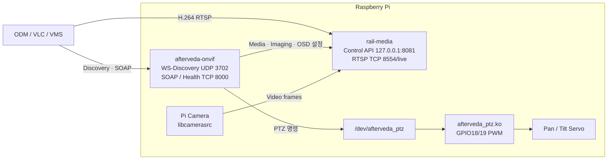

# Afterveda

**Raspberry Pi 카메라를 표준 ONVIF IP Camera로 동작시키는 Embedded Linux 프로젝트**

Afterveda는 Pi Camera 영상을 H.264 RTSP로 송출하고, ONVIF 클라이언트에서 장치 검색·영상 설정·PTZ·Imaging·OSD를 제어할 수 있도록 구성한 프로젝트다. 미디어 애플리케이션과 보드 종속 PTZ 커널 드라이버를 분리해 실제 하드웨어부터 VMS 클라이언트까지 하나의 흐름으로 연결한다.

> 이 저장소는 ONVIF 동작 호환성을 목표로 개발 중이며, 공식 ONVIF 적합성 인증을 받은 제품은 아니다.

## 대표 동작

| ONVIF Device Manager | RTSP 스트리밍 | 장비 상태 확인 |
|---|---|---|
| WS-Discovery로 카메라 검색 | `rtsp://<PI_IP>:8554/live` 재생 | ONVIF와 미디어 서버 상태 통합 조회 |
| 해상도·비트레이트 변경 | H.264 640x360 ~ 1920x1080 | pipeline, camera, client 수, uptime, 최근 오류 |
| Pan/Tilt, Imaging, OSD 제어 | 설정 변경 시 pipeline 재구성 | 미디어 장애 시 `degraded`와 HTTP 503 반환 |

```console
$ curl http://127.0.0.1:8000/health
{
  "status": "ok",
  "rail_media": {
    "reachable": true,
    "health": {
      "status": "ok",
      "rtsp_server": "ready",
      "pipeline": "ready",
      "camera": "ready",
      "rtsp_clients": 1
    }
  }
}
```

실제 장비에서 확인하는 전체 절차는 [배포 및 검증 가이드](docs/media-onvif-runtime/deploy-and-test.md)에 정리되어 있다.

## 전체 구조



영상 경로와 제어 경로를 분리했다. `afterveda-onvif`는 표준 ONVIF 요청을 처리하고, 실제 영상 설정은 `rail-media`에 전달한다. PTZ 요청은 문자 장치를 통해 별도 BSP 커널 모듈로 전달한다.

## 핵심 기능

| 영역 | 구현 기능 | 상태 |
|---|---|:---:|
| Discovery | WS-Discovery Probe 응답 및 XAddr 광고 | ✅ |
| Device | 장치 정보, 서비스, capability, 실제 네트워크 인터페이스 조회 | ✅ |
| Media | 단일 `main` 프로필, RTSP URI, H.264 설정 조회·변경 | ✅ |
| Video | 640x360 / 1280x720 / 1920x1080, FPS·비트레이트 설정 | ✅ |
| PTZ | ContinuousMove, RelativeMove, Stop, Home, Preset, 실제 MoveStatus | ✅ |
| Imaging | 밝기·대비·채도 조회 및 GStreamer pipeline 반영 | ✅ |
| OSD | 표준 Media OSD 요청으로 텍스트 표시·변경·삭제 | ✅ |
| Health | 카메라·pipeline·RTSP client·uptime·최근 오류 통합 상태 | ✅ |
| Security | 선택적 ONVIF UsernameToken 및 RTSP Digest 인증 | ✅ |
| Deployment | Raspberry Pi 4/5 64-bit 크로스 빌드 프리셋 | ✅ |
| Compliance | 공식 ONVIF Device Test Tool 검증 | 예정 |

지원하지 않는 Events/Notification, Zoom, Advanced Security 기능은 capability에 광고하지 않는다.

## 빠른 실행

### 1. Raspberry Pi용 빌드

개발 PC의 `sysroot/raspi-aarch64`에 Raspberry Pi용 GStreamer, libsoup, json-glib, gSOAP 개발 파일이 준비되어 있어야 한다.

```bash
cd ~/workspace/afterveda
cmake --preset pi-release
cmake --build --preset pi-release -j2
```

생성 파일:

```text
build/pi-release/media-server/rail-media
build/pi-release/onvif-server/afterveda-onvif
```

### 2. Raspberry Pi로 전송

```bash
scp \
  build/pi-release/media-server/rail-media \
  build/pi-release/onvif-server/afterveda-onvif \
  seok@192.168.0.32:~/afterveda-bin/
```

### 3. Raspberry Pi에서 실행

먼저 미디어 서버를 실행한다.

```bash
~/afterveda-bin/rail-media \
  --encoder v4l2 \
  --profile main \
  --control-host 127.0.0.1
```

다른 터미널에서 ONVIF 서버를 실행한다.

```bash
~/afterveda-bin/afterveda-onvif \
  --xaddr-host 192.168.0.32 \
  --rtsp-uri rtsp://192.168.0.32:8554/live \
  --rail-control-url http://127.0.0.1:8081 \
  --ptz-device /dev/afterveda_ptz
```

PTZ 하드웨어 없이 먼저 확인하려면 마지막 옵션을 `--ptz-dry-run`으로 바꾼다.

### 4. 동작 확인

```bash
curl -i http://127.0.0.1:8081/health
curl -i http://127.0.0.1:8000/health
ffplay rtsp://192.168.0.32:8554/live
```

이후 ONVIF Device Manager에서 `192.168.0.32` 장치를 검색해 Live video, Video streaming, PTZ control 메뉴를 확인한다.

## 해결한 핵심 문제 3개

### 1. ODM 설정값과 실제 영상이 서로 달라지는 문제

- **증상:** ODM에서 1920x1080으로 변경해도 다시 조회하면 640x360 프로필이 표시됐다.
- **원인:** 실제 RTSP pipeline은 하나인데 여러 ONVIF 프로필을 광고했고, 설정 토큰과 실제 encoder 상태가 일치하지 않았다.
- **해결:** ONVIF 프로필을 `main`, encoder 토큰을 `encoder-main`으로 고정하고 모든 Media 설정 조회·변경을 동일한 `rail-media` 인스턴스에 연결했다.
- **결과:** 설정 변경 후 재조회해도 같은 토큰과 실제 적용값이 유지된다.

### 2. 직접 XML 조립으로 capability가 실제 구현과 달라지는 문제

- **증상:** 구현하지 않은 Events, Zoom, Advanced Security 등이 클라이언트에 노출되고 서비스별 XML 형식도 일관되지 않았다.
- **원인:** SOAP 응답 XML을 문자열로 직접 만들면서 스키마 타입과 capability를 수동으로 관리했다.
- **해결:** Device, Media, Media2, PTZ, Imaging, Media OSD를 typed gSOAP 구조체 기반으로 전환하고 미지원 capability 광고를 제거했다.
- **결과:** 컴파일 단계에서 타입을 검증할 수 있고, ODM에는 실제 제공 기능만 노출된다.

### 3. ONVIF 서버만 살아 있으면 정상으로 보이는 문제

- **증상:** 카메라 또는 GStreamer pipeline이 실패해도 ONVIF `/health`가 항상 정상으로 응답했다.
- **원인:** ONVIF 프로세스 상태와 실제 미디어 처리 상태가 분리되어 있었다.
- **해결:** `rail-media`가 pipeline, camera, RTSP client 수, uptime, 준비 시각, 최근 오류를 수집하고 ONVIF 서버가 이 상태를 통합 조회하도록 구성했다.
- **결과:** 미디어 서버가 중단되거나 오류 상태이면 ONVIF `/health`가 `degraded`와 HTTP 503을 반환한다.

## 프로젝트 구조

```text
afterveda/
├── media-server/     # Pi Camera, GStreamer, H.264 RTSP, 제어 API
├── onvif-server/     # WS-Discovery, gSOAP Device/Media/PTZ/Imaging/OSD
├── cmake/            # Raspberry Pi aarch64 크로스 컴파일 toolchain
├── docs/             # 설계, 배포, 테스트 및 트러블슈팅 문서
└── CMakePresets.json

../afterveda-bsp/
└── ptz-kmod/         # /dev/afterveda_ptz, GPIO18/19 PWM 커널 모듈
```

## 상세 문서

- [Media/ONVIF 런타임 개요](docs/media-onvif-runtime/README.md)
- [미디어 서버 설계와 API](docs/media-onvif-runtime/media-server.md)
- [ONVIF 서비스와 지원 작업](docs/media-onvif-runtime/onvif-server.md)
- [Raspberry Pi 배포 및 ODM 검증](docs/media-onvif-runtime/deploy-and-test.md)
- [전체 아키텍처](docs/architecture.md)
- [WS-Discovery UDP 단편화 트러블슈팅](troubleshooting/onvif-ws-discovery-udp-fragmentation.md)

## 남은 검증

- 실제 Raspberry Pi 카메라에서 광고한 모든 해상도의 pipeline 협상 확인
- 장시간 스트리밍과 다중 RTSP 클라이언트 부하 측정
- 주요 SOAP 요청·Fault 응답 자동 테스트 및 CI 구성
- 공식 ONVIF Device Test Tool 기반 적합성 검증
